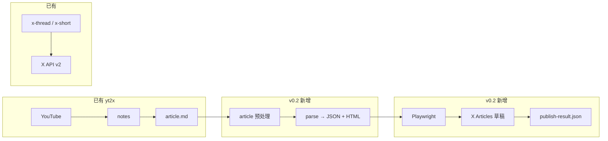

# X Articles 草稿发布任务

版本归属：**v0.2**

## 背景

yt2x 已从 YouTube 流水线生成 `files/articles/<videoId>/article.md`、封面与截图，但 **X Articles（长文编辑器）没有公开发布 API**。当前 `publish --target article` 在非 dry-run 下会误走 Tweet API 单条发帖路径，或仅依赖人工复制粘贴。

社区方案 [publish-x-article](https://github.com/wshuyi/x-article-publisher-skill)（及 Cursor Skill 同源）已验证可行路径：

```text
Markdown 预处理 → HTML + block_index 元数据 → 系统剪贴板 → 浏览器操作 X Articles 编辑器 → 仅保存草稿
```

本任务把该路径收编为 yt2x 的 **第二条发布通道**（`api` 用于 thread/short，`browser-draft` 用于 article），与 ADR-0003 发布安全原则一致：**不自动点击发布，只写入 X 草稿箱**。

## 目标

```text
files/articles/<videoId>/article.md
  -> 预处理（Premium / Premium+ 规则）
  -> 解析（title, cover, content_images, dividers, html, block_index）
  -> Playwright 驱动 x.com/compose/articles
  -> 草稿已保存
  -> publish-result.json + process-status.json 更新
```

首个可交付版本（MVP）：

- CLI：`pnpm yt2x publish --video-id <videoId> --target article --browser-draft`
- 可选：`pipeline --publish review` 在 review 阶段额外生成浏览器草稿（仍不真发 Tweet）
- 依赖：本机已登录 X Premium、Playwright、Python 剪贴板脚本（或 TS 等价实现）
- 产物契约：`publish-result.json` 记录 `mode: "article-draft"` 与编辑器 URL（若可获取）

在浏览器草稿通道闭环前，先交付一条独立安全切片：`publish --target article`
在非 dry-run 下立即失败，确保长文不会继续误走 Tweet API。

## 非目标

- 不实现 X Articles **一键正式发布**（与 Skill 一致，用户人工预览后发布）。
- 不把浏览器 cookies / 登录态写入仓库或 `process-status.json`。
- 不在默认 `ci:full` 中跑真实 X 浏览器 E2E（仅单测 + 可选手测清单）。
- 不替代现有 `x-thread` / `x-short` / `x-thread-short` 的 OAuth API 发布。
- v0.2 MVP 不要求 headless CI 稳定通过 X 人机验证。

## 设计原则

- **双通道发布**：`XPublishPort`（API）与 `XArticlesDraftPort`（浏览器）职责分离。
- **先文后图后分割线**：正文 HTML 一次粘贴；图片与 `---` 按 `block_index` **从大到小**插入。
- **不改原稿**：预处理写入 `article_for_x.md` 或 `/tmp/`，保留 `article.md`。
- **显式 opt-in**：`--browser-draft` 才启动浏览器；默认 `article` 仍只做 dry-run / preview。
- **与生成阶段对齐**：复用 `images/cover.*`、正文图片路径；`<video>` 标签在预处理阶段降级为链接或说明文字。

## 架构示意



## 依赖与前置

| 依赖 | 用途 | 安装提示 |
|------|------|----------|
| Playwright | 浏览器自动化 | `pnpm exec playwright install chromium` |
| Python 3.9+ | 剪贴板 / 表格转图（MVP 可子进程） | `pip install Pillow markdown`；macOS 加 `pyobjc-framework-Cocoa` |
| mermaid-cli | 可选，文中有 mermaid 时 | `npm i -g @mermaid-js/mermaid-cli` |
| X Premium | Articles 功能 | 用户本机浏览器已登录 |

## 产物契约扩展

`publish-result.json`（`mode: "article-draft"`）建议字段：

```json
{
  "profile": "default",
  "mode": "article-draft",
  "source": "article.md",
  "adaptedSource": "article_for_x.md",
  "subscriptionTier": "premium",
  "draftSavedAt": "ISO-8601",
  "editorUrl": "https://x.com/compose/articles/...",
  "warnings": []
}
```

`process-status.json` 的 `steps.publish` 在 draft 成功时：`status: "done"`，`resultFile: "publish-result.json"`（与 API 发布相同字段，用 `mode` 区分）。

---

## 任务列表

实施顺序见下方「建议排期」；每完成一项，将对应 **完成后标记** 勾选为 `[x]`。

### Task 1: ADR — Article 浏览器草稿发布通道

状态：未开始

范围：

- 新增 `docs/adr/0004-article-browser-draft-publish.md`。
- 记录决策：`article` 永不走 `postTweet`；浏览器草稿为 opt-in；与 ADR-0003 安全规则关系。
- 定义 `XArticlesDraftPort` 与 `XPublishPort` 边界。

验收：

- ADR 状态为 Accepted，含 Consequences 正负项。
- 明确「不自动 publish」为硬性约束。

完成后标记：

- [ ] Task 1 complete

---

### Task 2: Core — Article 预处理纯函数

状态：未开始

范围：

- 在 `packages/core/src/domain/publish/` 新增模块（例如 `article-for-x.ts`）。
- 输入：`article.md` 字符串 + `subscriptionTier: "premium" | "premium-plus"`。
- 输出：适配后 markdown + `adaptations[]` 变更摘要（表格→图片占位、mermaid→图片、H3+ 扁平化规则）。
- 规则表与 publish-x-article Skill 的 Premium / Premium+ 对照表一致。
- 单测：fixture 覆盖表格、深层标题、列表内图片（应 reject 或已由 generator 避免）。

验收：

- 不依赖 Node / 浏览器。
- `pnpm --filter @yt2x/core test` 通过新增用例。

完成后标记：

- [ ] Task 2 complete

---

### Task 3: 解析层 — Markdown → HTML + block_index

状态：未开始

范围：

- 方案 A（推荐 MVP）：`packages/adapters-node` 子进程调用 vendored / 文档化的 `parse_markdown.py`（从 publish-x-article 移植并加 LICENSE 注明）。
  若选择该方案，脚本必须进入发布包契约：构建时复制到 `dist/scripts/x-articles/`
  并从安装后的稳定路径解析，或在 package `files` 中显式分发等价脚本路径。
- 方案 B：将 `parse_markdown.py` 逻辑移植为 TypeScript（`markdown` npm 包 + 自研 block 切分）。
- 输出类型在 `packages/core` 定义 Zod schema：`ArticleDraftParseResult`（title, cover_image, content_images, dividers, html, total_blocks）。
- 封面规则：第一张图或 `images/cover.*`；与 `findCoverImage` 对齐。

验收：

- 对 `packages/core` 或 adapters 内 fixture `article.md` 解析稳定。
- `block_index` 与 `total_blocks` 有单测；图片、分割线位置可复现。
- 若保留 Python 解析脚本，`pnpm pack` 后 tarball 含运行所需脚本，安装后不依赖源码目录或外部 Skill 路径。

完成后标记：

- [ ] Task 3 complete

---

### Task 4: 剪贴板与表格/Mermaid 转图

状态：未开始

范围：

- 封装 `copy_to_clipboard.py`（html / image + quality）或 TS 等价（macOS 优先，Windows 文档说明）。
- 若保留 Python 剪贴板 / 转图脚本，脚本分发规则与 Task 3 一致，不从
  `packages/adapters-node/scripts/` 源码路径或用户 `~/.claude/skills/` 路径取运行时依赖。
- 封装 `table_to_image.py`；Mermaid 调用 `mmdc` 可选，失败时写入 `warnings` 不阻断。
- CLI 层在 `--browser-draft` 前检查依赖，缺失时 `printCliErrorBlock` 给出安装命令。

验收：

- 本地 macOS 手测：HTML 粘贴到 TextEdit 保留 H2/列表（冒烟）。
- 表格样例可生成 PNG 并出现在 `content_images` 列表。

完成后标记：

- [ ] Task 4 complete

---

### Task 5: Core port — `XArticlesDraftPort`

状态：未开始

范围：

- `packages/core/src/ports/x-articles-draft.ts` 定义接口，例如：

```ts
export interface XArticlesDraftPort {
  saveDraft(input: SaveArticleDraftInput): Promise<SaveArticleDraftResult>;
}
```

- `SaveArticleDraftInput` 含 `parseResult`、`articleDir`、可选 `headless`、`timeoutMs`。
- 结果含 `draftSavedAt`、`editorUrl?`、`warnings[]`。

验收：

- `packages/core` 导出类型；无 Node 实现。

完成后标记：

- [ ] Task 5 complete

---

### Task 6: Playwright 适配器 — Articles 编辑器自动化

状态：未开始

范围：

- `packages/adapters-node/src/x-articles-draft/` 实现 `XArticlesDraftPort`。
- 流程（与 Skill 对齐）：
  1. `goto` `https://x.com/compose/articles`
  2. 点击 **Create**
  3. `file_upload` 封面
  4. 填写标题
  5. 剪贴板粘贴 HTML 正文
  6. 按 `block_index` **降序**插入内容图
  7. 按 `block_index` **降序** Insert → Divider
  8. 等待自动保存；**不**点击发布按钮
- 登录态：使用 **persistent context** 用户数据目录（例如 `~/.config/yt2x/browser-profile`），文档说明首次需人工登录。
- 等待策略：集中封装上传完成等待，优先使用与 locale 无关的编辑器 / 上传状态信号；
  上传提示文案只能作为多语言 fallback，不能把 `textGone="正在上传媒体"` 作为唯一条件；
  避免多余 snapshot。

验收：

- 手测一篇 `<videoId>` 长文进入草稿箱，版式基本正确。
- 未登录时返回可读错误，提示打开浏览器登录。
- 上传等待至少在已验证 locale 下有手测记录；若使用文案 fallback，覆盖中文与英文界面。

完成后标记：

- [ ] Task 6 complete

---

### Task 7: 阻断 article 的 API 误发布

状态：未开始

范围：

- 作为独立安全切片优先交付，不依赖 Task 2–6 的浏览器草稿能力。
- `executeNativePublish`：先在安全切片中让 `publishTarget === "article"` 的非 dry-run
  API 路径 **立即**返回清晰错误（exit 2），文案至少指向 `--dry-run` 并说明 Article
  当前无 API 发布路径。
- Task 8 接入 `--browser-draft` 后，保留上述 API 阻断，只让显式浏览器草稿分支继续进入
  Task 9 的 browser-draft orchestration；届时错误文案再补充指向 `--browser-draft`。
- 删除 / 禁止 `prepareTextForXPublish` + `postTweet` 作为 article 真实发布路径。
- 更新 `native-publish.test.ts`：断言错误信息含 `browser-draft` 或 `no API`，并验证
  OAuth / X publish adapter 不会被调用，而非仅依赖无凭证环境返回相同 exit code。

验收：

- `publish --target article`（无 dry-run、无 browser-draft）稳定失败且不调用 adapter。
- `publish --target x-thread` 行为不变。
- 此任务可在 ADR 与 browser-draft 实现完整落地前单独合并。

完成后标记：

- [ ] Task 7 complete

---

### Task 8: CLI — `--browser-draft` 与订阅档位

状态：未开始

范围：

- `publish` 命令新增：
  - `--browser-draft`：启用 Task 6 流程。
  - `--x-subscription <premium|premium-plus>`：默认 `premium`；影响预处理（Task 2）。
  - `--browser-profile-dir <path>`：可选，覆盖 Playwright 用户目录。
  - `--headless`：默认 false（有头模式便于登录与排障）。
- `publish --help` 与 `printCliErrorBlock` hints 更新。

验收：

- `pnpm yt2x publish --help` 可见新参数说明。
- 非法 `--x-subscription` 值报错。

完成后标记：

- [ ] Task 8 complete

---

### Task 9: Orchestrator 集成 — `executeNativePublish`

状态：未开始

范围：

- 在 `native-publish.ts` 串联：读 `article.md` → Task 2 预处理 → 写 `article_for_x.md` → Task 3 解析 → Task 4 剪贴板 → Task 6 `saveDraft`。
- 写 `publish-result.json`（`mode: "article-draft"`）。
- `patchProcessStatus` 更新 `steps.publish`（与 dry-run / API 发布一致字段）。
- dry-run 扩展：除现有文本预览外，可选输出「将执行的浏览器步骤摘要」到 `publish-preview.json`（`plannedSteps[]`）。

验收：

- `publish --target article --browser-draft --video-id <videoId>` 端到端手测成功。
- `publish --target article --dry-run` 仍不写浏览器、不调 API。

完成后标记：

- [ ] Task 9 complete

---

### Task 10: Pipeline — `review` 可选生成草稿

状态：未开始

范围：

- 新增 pipeline 阶段选项或 publish 子标志，例如：
  - `pipeline --publish review --article-draft-browser`（命名以实现为准），或
  - `publish` stage 在 `review` 且 target 含 article 时调用 browser-draft。
- 默认 **不** 开启；文档强调需本机浏览器与 Premium。

验收：

- `pipeline --publish review` 默认行为不变（仅 preview JSON）。
- 显式开启时写完 `publish-result.json` 且 `mode` 为 `article-draft`。

完成后标记：

- [ ] Task 10 complete

---

### Task 11: 预处理 — `<video>` 与无效元素

状态：未开始

范围：

- `article_for_x` 预处理将 `<video controls src="...">` 转为「完整视频」链接块（复用 `metadata.json` 的 `webpage_url` 若可得）。
- 正文内相对路径图片解析为绝对路径（与 `parse_markdown` 搜索目录一致）。
- 生成阶段已有「列表内图片」校验；发布前再 guard 一次，失败时 warning 或 exit。

验收：

- 含 `<video>` 的 fixture 预处理后无 HTML video 标签进入粘贴 HTML。
- 缺失图片文件时 CLI 报错或 warning 列表可读。

完成后标记：

- [ ] Task 11 complete

---

### Task 12: Agent 文档衔接（L1，零代码依赖）

状态：未开始

范围：

- 更新 `docs/AGENT-PROMPTS.md`：pipeline 完成后可对 `files/articles/<videoId>/article.md` 使用 publish-x-article Skill，或调用 `yt2x publish --browser-draft`。
- 说明两路径差异：外部 Skill（Cursor）vs 内置 CLI。

验收：

- 文档仅用 `<videoId>` / `<YOUTUBE_URL>` 占位符。
- 与 Task 9 命令一致。

完成后标记：

- [ ] Task 12 complete

---

### Task 13: 单测与可选 E2E

状态：未开始

范围：

- 单测：Task 2 预处理、Task 3 解析 JSON schema、Task 7 article API 阻断。
- 打包冒烟：若保留 Python 脚本，检查 CLI / adapters-node pack 产物包含运行时脚本，
  并从安装后路径跑不触网 fixture 解析。
- Playwright：默认 mock 或跳过；可选 `YT2X_E2E_ARTICLE_DRAFT=1` 手测脚本（不进 `ci:full`）。
- `package.json` 可增加 `test:article-draft:e2e` 脚本占位。

验收：

- `pnpm run check` 通过。
- E2E 脚本在 README / USAGE 标明 opt-in。

完成后标记：

- [ ] Task 13 complete

---

### Task 14: 用户文档

状态：未开始

范围：

- 更新 `README.md`、`docs/USAGE.md`、`docs/DATA-CONTRACTS.md`。
- 说明：`article` API 发布不存在；`--browser-draft` 流程、依赖、Premium 档位、安全（仅草稿）。
- 故障排查：登录、上传超时、Mermaid/表格依赖。

验收：

- 示例命令使用占位符。
- 与 ADR-0004 无矛盾。

完成后标记：

- [ ] Task 14 complete

---

### Task 15: 许可证与脚本归属

状态：未开始

范围：

- 若 vendored `parse_markdown.py` 等来自 [wshuyi/x-article-publisher-skill](https://github.com/wshuyi/x-article-publisher-skill)，在 `NOTICE` 或 `third_party/` 注明版权与许可证。
- 源码归属路径可为 `packages/adapters-node/scripts/x-articles/`（或等价），避免依赖用户 `~/.claude/skills/`。
- 明确发布包策略：推荐构建时复制 Python 脚本到 `packages/adapters-node/dist/scripts/x-articles/`
  并从 `dist` 运行时路径加载；若改用 package `files` 分发源码脚本或 TS 等价实现，
  也必须保证安装后的 CLI 不依赖 monorepo 源码布局。

验收：

- 新 clone 仓库不安装 Cursor Skill 也可运行 `--browser-draft`。
- `pnpm pack` 产物包含 Python 运行时脚本，或实现已改为无需这些脚本。
- 从打包 / 安装后的 CLI 运行 fixture 级脚本发现与解析冒烟测试，不依赖源码目录。
- NOTICE 合规审查通过。

完成后标记：

- [ ] Task 15 complete

---

## 建议排期

```text
Task 7 (独立安全切片：先阻断 article API 误发布)
  -> Task 1 (ADR)
  -> Task 2, 3, 4 可并行
  -> Task 5
  -> Task 6
  -> Task 8
  -> Task 9
  -> Task 10, 11 可并行
  -> Task 12, 13, 14, 15
```

最早安全交付：**Task 7**。

MVP 最小闭环：**Task 7 → 1 → 2 → 3 → 4 → 5 → 6 → 8 → 9 → 14 → 15**
（Task 10–13 可紧随其后）。

## 总体验收（v0.2 MVP）

- [ ] `pnpm yt2x article --video-id <videoId>` 生成 `article.md` 与封面。
- [ ] `pnpm yt2x publish --video-id <videoId> --target article --dry-run` 只写 `publish-preview.json`，不启浏览器、不调 API。
- [ ] `pnpm yt2x publish --video-id <videoId> --target article`（无 flag）明确失败并提示 `--browser-draft`。
- [ ] `pnpm yt2x publish --video-id <videoId> --target article --browser-draft` 在本机 Premium 账号下将长文写入 X 草稿箱。
- [ ] `publish-result.json` 含 `mode: "article-draft"` 与时间戳。
- [ ] `process-status.json` 的 `publish` 步与 API 发布共用契约、可区分 `mode`。
- [ ] `pnpm yt2x publish --target x-thread` 回归通过。
- [ ] `pnpm run check` 通过。

## 风险与缓解

| 风险 | 缓解 |
|------|------|
| X 编辑器 DOM 变更 | 选择器集中在一文件；手测清单；版本号写入 `publish-result.warnings` |
| 人机验证 / 登录过期 | persistent profile + 有头默认；错误提示重新登录 |
| Python / Playwright 依赖重 | opt-in flag；依赖检查与文档；长期 Task 3 方案 B 减依赖 |
| 草稿与 API 发布混淆 | `mode` 字段 + ADR + CLI 硬阻断 |

## 完成后总标记

当上述 **Task 1–15** 的「完成后标记」均为 `[x]`，且 **总体验收** 全部勾选时，在本节改为：

- [ ] **ARTICLE-DRAFT-PUBLISH v0.2 complete**

（全部完成后由维护者勾选。）

---

## 参考

- [wshuyi/x-article-publisher-skill](https://github.com/wshuyi/x-article-publisher-skill)
- 仓库内讨论：publish-x-article Skill 与 yt2x `files/articles/` 产物对齐分析
- [ADR-0003: 发布安全与每视频状态契约](./adr/0003-publish-safety-and-process-status.md)
- [X target output task](./X-TARGET-OUTPUT-TASK.md)（Task 9：`article` 不走 API）
