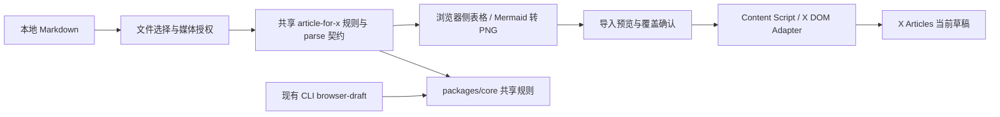

# X Articles Chrome Markdown 导入插件任务

版本归属：**v0.2**

## 背景

yt2x 已实现 `publish --target article --browser-draft`：由 CLI 读取
`article.md`，按 X Premium / Premium+ 能力适配内容，再由 Playwright 把文章写入
X Articles 草稿。该通道适用于 yt2x 产物与自动化执行，但用户在已经打开的 X 长文草稿页
中仍缺少一个轻量入口，无法直接选择任意 Markdown 文档并导入当前编辑器。

本任务新增 Chrome 扩展，在 X Articles 草稿编辑页的编辑控件旁注入 **导入 Markdown**
按钮。点击后选择本地 `.md` 文件，先展示解析结果和降级转换警告，再把内容写入当前草稿；
扩展只操作草稿，不触发正式发布。

本方案参考 `publish-x-article` Skill 的核心流程：

```text
Markdown 读取与预处理
  -> title / HTML / media / divider / block_index 解析
  -> 用户确认变更摘要
  -> 当前 X Articles 编辑器写入正文
  -> 反向插入媒体与 Divider
  -> 用户自行预览和发布
```

## 已确认决策

以下选择已在方案开始前确认：

| 决策项         | 结论                                                            |
| -------------- | --------------------------------------------------------------- |
| 与现有通道关系 | 与 `--browser-draft` 并存，插件作为当前编辑页的快捷入口         |
| 首版范围       | 仅导入 Markdown 到当前已打开的草稿编辑器                        |
| 注入位置       | 已打开的 X Articles 编辑页，按钮紧邻现有编辑按钮                |
| 订阅支持       | Premium 与 Premium+ 均支持；首要验收环境为 **X Premium**        |
| 文件入口       | 点击按钮选择单个 `.md` 文件                                     |
| 图片支持目标   | Markdown 的本地相对路径与绝对路径引用                           |
| 标题与封面     | 首个 H1 为标题且不进入正文；显式封面优先，否则首张图为封面      |
| Premium 降级   | H3+ 语义扁平化；表格转图片；Mermaid 转 PNG                      |
| 正文结构       | 代码块与现有实现对齐；`---` 通过原生 Divider 插入               |
| 导入保护       | 导入前预览摘要；已有正文时要求覆盖确认或取消                    |
| 安全边界       | 只写入草稿，绝不点击发布                                        |
| 代码复用       | 优先复用 `packages/core` 的规则与契约，不复制业务规则           |
| 技术栈选择     | 先适配仓库现有 TypeScript / pnpm / Vitest / ESLint 构建体系     |
| MVP 验收       | 真实 X 草稿页导入含标题、图片、表格/分割线的 Markdown，且不发布 |

## 关键约束

### 1. Chrome 不能凭 Markdown 路径任意读取本地素材

单独选择 `.md` 文件时，扩展不能直接读取文件中引用的任意本地路径，包括
`images/cover.png` 或 `/Users/.../cover.png`。因此首版交互定义为：

1. 用户先选择一个 `.md` 文件。
2. 扩展解析其中的本地媒体引用，并在预览面板列出所需素材。
3. 若存在未授权素材，用户追加选择文章目录或所需素材文件。
4. 扩展以相对路径和文件名进行映射；所有必需素材解析成功后才允许写入草稿。

这保留了单文件入口，同时不声称扩展能够绕过浏览器文件权限。

### 2. 浏览器扩展不能复用 Node / Playwright 实现细节

`packages/core/src/domain/publish/` 中的纯转换规则可直接复用或抽取为浏览器可发布构建；
以下现有实现不可直接打进扩展：

- `packages/adapters-node` 中依赖 `node:fs`、`node:path` 的本地文件解析。
- 使用 Playwright 截图生成表格 PNG 的 materialize 流程。
- 由 Playwright 创建 persistent profile、定位页面并操作文件上传的适配器。

扩展需实现浏览器侧文件句柄、Canvas / DOM 转图和当前页面 DOM 写入适配层，并共享 core
中的订阅规则与解析契约。

### 3. X DOM 是非公开接口

按钮挂载点、编辑器定位器、Insert 菜单和媒体上传行为都可能随 X 页面更新而变化。扩展应
将 DOM 选择器和 locale fallback 集中管理；找不到稳定控件时必须终止导入并显示可操作
错误，不能静默写入错误位置。

## 目标

```text
用户打开 X Articles 草稿编辑页
  -> content script 注入“导入 Markdown”按钮
  -> 用户选择 .md，并按需授权本地素材
  -> 共享 core 规则适配 Premium 内容
  -> 扩展预览标题、封面、转换项与缺失素材
  -> 用户确认覆盖当前正文
  -> 页面适配器写入 HTML、媒体、代码块、Divider
  -> 留在草稿页供用户人工复核和发布
```

首个可交付版本（MVP）：

- Manifest V3 Chrome 扩展，可开发者模式加载。
- 只在 `https://x.com/compose/articles*` 的草稿编辑上下文注入按钮。
- 支持本地 `.md` 导入、素材授权、Premium / Premium+ 选择与转换摘要。
- Premium 路径支持 H3+ 降级、表格 PNG 化和 Mermaid PNG 化。
- 正文写入前检测非空编辑器并执行明确覆盖确认。
- 导入成功仅显示“草稿内容已写入，请人工复核后发布”，不触发发布行为。

## 非目标

- 不取代 CLI 的 `--browser-draft` 通道，也不改变其数据契约或行为。
- 不创建、切换或管理草稿列表；首版只处理当前打开的编辑页。
- 不自动正式发布 X Article。
- 不读取或导出 X cookies、浏览器凭证、OAuth token。
- 不向仓库写入用户导入的文档、图片或草稿内容。
- 不承诺适配所有 X 页面变体或人机验证流程。
- 不在首版完成 Chrome Web Store 发布材料与审核流程。

## 设计原则

- **规则共享，页面适配分离**：订阅降级、草稿解析数据模型留在共享纯函数层；Chrome
  DOM、文件授权、图像生成和交互界面留在扩展层。
- **先预览后写入**：先完成解析、转换、素材校验和变更摘要，再要求用户确认导入。
- **先文后图后结构块**：正文 HTML 先写入；代码块、图片、视频和 Divider 按
  `blockIndex` 从后向前插入，保持与现有草稿通道相同的定位语义。
- **不覆盖原文档**：扩展只在内存中生成适配稿与 PNG blob，不修改用户选择的 Markdown。
- **显式破坏性确认**：当前草稿正文不为空时只允许用户明确选择覆盖或取消；MVP 不支持追加。
- **发布边界不可配置**：扩展不提供自动发布选项，按钮与权限中不出现正式发布行为。

## 架构示意



## 建议目录与分层

```text
packages/core/
  src/domain/publish/article-for-x.ts       # 已有：订阅适配规则，扩展复用
  src/domain/publish/article-draft.ts       # 已有：解析结果契约，扩展复用
  src/domain/publish/article-draft-parse.ts # 建议新增：移出的浏览器安全纯解析函数

packages/x-article-extension/                  # 新增 MV3 workspace package
  src/background/                            # 可选：扩展生命周期与消息路由
  src/content/x-articles.ts                  # 按钮注入、DOM 监听与编辑器适配器
  src/ui/import-dialog.ts                    # 文件选择、预览、订阅档位与确认界面
  src/files/local-media.ts                   # File System Access / file input 素材映射
  src/render/table-image.ts                  # 浏览器侧表格 Blob/PNG 生成
  src/render/mermaid-image.ts                # Mermaid 渲染为 PNG
  src/manifest.json
```

`packages/adapters-node/src/x-articles-draft/parse-article-draft.ts` 当前混合了 Markdown
解析和 Node 路径解析。落地插件前，应先把不依赖文件系统的 block 拆分、标题提取、
Divider 推导和 HTML 渲染抽到 `packages/core` 的浏览器安全模块，Node 与插件分别只完成
媒体路径 / `File` 解析。

## 用户流程

1. 用户在 X Articles 中打开一个已有或新建草稿。
2. 扩展确认编辑器存在，在编辑控件旁显示 **导入 Markdown**。
3. 用户点击按钮，选择一个 `.md` 文件，并选择 `Premium` 或 `Premium+`；默认记忆上次
   选择，首要测试档位为 `Premium`。
4. 扩展解析标题、正文块、图片、表格、Mermaid、代码块与分割线。
5. 若 Markdown 引用了本地素材，扩展请求用户选择文章目录或补充素材文件，并标出仍缺失
   的引用。
6. 扩展生成预览摘要：标题、封面候选、转换项、警告、缺失素材和将覆盖正文的提醒。
7. 仅当素材齐全且用户确认覆盖后，开始写入 X 编辑器。
8. 扩展填写标题与封面，粘贴/写入富文本正文，随后反向插入媒体和 Divider。
9. 扩展验证没有触发发布动作并提示用户在页面中人工复核。

## Markdown 转换规则

| 元素    | Premium                         | Premium+ | 首版实现要求                    |
| ------- | ------------------------------- | -------- | ------------------------------- |
| 首个 H1 | 用作标题，不写入正文            | 同左     | 复用草稿解析契约                |
| H2      | 原生保留                        | 原生保留 | HTML 正文写入                   |
| H3+     | 转为语义化粗体或必要时提升为 H2 | 原生保留 | 预览显示转换摘要                |
| 表格    | 转 PNG 并插入媒体位置           | 原生保留 | 浏览器 DOM/Canvas 生成 PNG      |
| Mermaid | 转 PNG                          | 转 PNG   | bundling 渲染器，不调用本地 CLI |
| 代码块  | 对齐现有 X 原生 Code 插入流程   | 同左     | 插入失败则停止并提示            |
| 图片    | 解析为封面或内容媒体            | 同左     | 必须先完成文件授权              |
| `---`   | Insert > Divider                | 同左     | 不依赖 HTML `<hr>`              |

## 权限与数据边界

建议 Manifest V3 权限保持最小化：

| 权限 / 匹配范围                                                | 用途                               |
| -------------------------------------------------------------- | ---------------------------------- |
| `content_scripts.matches: ["https://x.com/compose/articles*"]` | 只在 Articles 页面注入导入入口     |
| `storage`                                                      | 保存用户的订阅档位与非敏感 UI 偏好 |
| 页面内文件选择 / File System Access 用户授权                   | 读取本次导入所需 `.md` 与媒体      |

首版不申请读取浏览历史、cookies 或跨站点主机权限。导入内容与媒体仅在当前扩展运行上下文
中处理；除用户主动要求的非敏感设置外，不持久化文章内容。

## 与现有 CLI 通道的关系

| 能力     | CLI `--browser-draft`                     | Chrome 扩展                     |
| -------- | ----------------------------------------- | ------------------------------- |
| 入口     | yt2x article 目录与命令行                 | 用户当前打开的 X 编辑页         |
| 输入     | 仓库产出的 `article.md` 与素材目录        | 用户选择的任意 `.md` 与授权素材 |
| 转换规则 | `packages/core`                           | 同一共享规则                    |
| 页面控制 | Playwright 新建草稿                       | Content script 修改当前草稿     |
| 状态产物 | `article_for_x.md`、`publish-result.json` | 不写仓库产物，仅页面结果提示    |
| 发布安全 | 只保存草稿                                | 只写入草稿                      |

## 任务列表

实施顺序见下方建议排期；完成后在本文件中更新状态。

### Task 1: 共享解析层拆分

状态：已完成

范围：

- 把 `parse-article-draft.ts` 中与 Node 无关的标题、block、Divider 与 HTML 解析移入
  `packages/core`。
- 保持 `ArticleDraftParseResult` 的 `blockIndex` 语义不变。
- Node 适配器继续负责绝对磁盘路径与存在性检查；插件适配器负责 `File` / blob URL。

验收：

- 现有 CLI browser-draft 测试继续通过。
- 纯解析测试可在无 Node API 的环境执行。

### Task 2: 扩展 package 与开发加载骨架

状态：已完成

范围：

- 新增 `packages/x-article-extension` workspace package，沿用仓库 TypeScript、pnpm、
  ESLint、Prettier 与 Vitest 工具链。
- 选择与当前构建系统兼容的最小 MV3 bundling 方式；在实现 spike 后决定是否引入
  Vite 或轻量 bundler。
- 定义 content script、导入面板与 manifest 权限。

验收：

- `pnpm build` 可输出开发者模式可加载的扩展目录。
- 在 X Articles 编辑页中只注入一个导入按钮，路由变化后不重复挂载。

### Task 3: 文件读取、素材授权与预览面板

状态：已完成

范围：

- 点击导入按钮后选择一个 `.md`。
- 扫描相对/绝对本地媒体引用；对无法读取的路径请求用户补选目录或媒体文件。
- 在导入前展示标题、封面、转换摘要、警告、缺失素材与 Premium 档位。
- 检测当前编辑器已有正文，要求用户明确覆盖或取消。

验收：

- 未授权媒体不会进入写入阶段。
- 不修改源 Markdown 文件，也不持久化正文内容。

### Task 4: 浏览器侧 Markdown 适配与 PNG 生成

状态：已完成

范围：

- 使用共享 `adaptArticleForX` 处理 Premium 的 H3+ 与表格规则。
- 将 Premium 表格在扩展上下文中渲染为 PNG blob。
- 将 Mermaid 在两种档位下渲染为 PNG blob；渲染失败作为阻断错误，不静默遗漏图表。
- 解析得到标题、HTML、媒体、代码块、Divider 与 `blockIndex`。

验收：

- Premium 样例中 H3+、表格、Mermaid 都可在预览中看到转换结果。
- Premium+ 保留表格 / 深层标题，仅 Mermaid 转图。

### Task 5: X Articles DOM 写入适配器

状态：已完成

范围：

- 集中管理 X 编辑器、标题、封面、Insert 菜单、Code 与 Divider 的定位器。
- 填写封面与标题，写入正文 HTML。
- 按 `blockIndex` 从大到小插入代码块、内容媒体和 Divider。
- 媒体上传完成等待需包含 locale 无关信号，中文/英文提示仅作 fallback。

验收：

- 任一必需元素或定位锚点缺失时终止并显示错误。
- 代码中不存在点击 Publish / 发布按钮的逻辑。

### Task 6: 安全、回归测试与真实手测

状态：部分完成（单测与 DOM fixture 已落地；2026-06-02 已在真实 X Premium
Articles 页面完成页面漂移检查，文件导入因 Codex Chrome Extension 文件上传权限阻塞，待开启权限后复测）

范围：

- 单测：订阅适配、解析、素材映射、转换摘要、非空正文确认。
- DOM fixture 集成测试：按钮注入、HTML 写入、媒体/Divider 逆序插入、缺少控件时失败。
- 在真实 X Premium 草稿页完成手测，记录页面语言、输入样例和未覆盖风险。

验收：

- 样例包含 H1、H2/H3、封面、正文图、表格、Mermaid、代码块和 `---`。
- 完成导入后内容保存在草稿页，人工检查发布按钮未被自动触发。

手测记录（2026-06-02，Asia/Shanghai）：

- 环境：真实 Chrome 用户会话，X 已登录账号 `@php_martin`，页面 URL
  `https://x.com/compose/articles`，页面语言为中文。
- 页面状态：扩展按钮已成功挂载，检测到侧栏图标入口
  `#yt2x-import-markdown-icon-btn` 与空状态文本入口
  `#yt2x-import-markdown-text-btn`；X 页面包含 `文章 / 草稿 / 已发布` 与空状态
  `撰写` 文案，未发现注入按钮定位漂移。
- 样例输入：临时 Markdown fixture 覆盖 H1、H2、H3、本地图片、表格、Mermaid、
  `---` 分割线、粗体、斜体和链接；本地图片使用仓库扩展图标复制到临时目录作为 fixture。
- 阻塞点：点击导入按钮后文件选择器可打开，但 Codex Chrome Extension 的
  `fileChooser.setFiles` 返回 `Not allowed`，无法在当前权限下自动选择本地 `.md` 文件。
- 结论：真实页面按钮注入与入口定位通过；完整 Markdown 导入、草稿内容保存、图片上传、
  表格/Mermaid PNG 插入和发布按钮未触发仍待开启 Chrome 插件文件上传权限后复测。

## 建议排期

| 阶段 | 任务     | 输出                                      |
| ---- | -------- | ----------------------------------------- |
| A    | Task 1   | 可被 Node 与浏览器共同使用的解析/转换基础 |
| B    | Task 2–3 | 可加载扩展、按钮与导入预览交互            |
| C    | Task 4   | Premium 优先的完整内容适配                |
| D    | Task 5   | 当前草稿写入闭环                          |
| E    | Task 6   | 测试与真实 X Premium 手测记录             |

## 风险与应对

| 风险                           | 影响           | 应对                                                       |
| ------------------------------ | -------------- | ---------------------------------------------------------- |
| X DOM 或文案更新               | 注入或写入失败 | 集中 locator、fixture 测试、失败即停止写入                 |
| 本地媒体未授权                 | 图片或封面缺失 | 写入前强制素材解析完整性检查                               |
| Mermaid bundle 体积或 CSP 限制 | 无法转换图表   | 在 Task 4 先做 extension CSP spike，失败则阻断而非降级遗漏 |
| 富文本写入被 X 清洗            | 排版丢失       | 用真实草稿 fixture/手测校验正文、列表与链接                |
| 草稿中已有内容                 | 用户内容被覆盖 | 默认检测并要求显式覆盖确认                                 |
| 共享解析抽取影响 CLI           | 现有发布回归   | 保留原测试并增加共享契约回归测试                           |

## 验收清单

- [ ] 扩展可在 Chrome 开发者模式加载，且只作用于 X Articles 编辑上下文。
- [ ] 导入按钮显示在目标编辑控件旁，重复导航不会生成重复按钮。
- [ ] 可选择 `.md` 并为所引用的本地媒体完成显式授权。
- [ ] X Premium 下 H3+、表格与 Mermaid 按规则转换，预览可见转换摘要。
- [ ] 标题、封面、正文图片、代码块和 Divider 均写入预期位置。
- [ ] 已有正文时，未确认覆盖不会写入内容。
- [ ] 扩展无自动正式发布路径，无 token / cookie / 正文内容持久化。
- [ ] 真实 X Premium 草稿手测通过，并记录 DOM 变化残余风险。

## 相关文档

- [ARTICLE-DRAFT-PUBLISH-TASK.md](./ARTICLE-DRAFT-PUBLISH-TASK.md)
- [ADR-0004: Article 浏览器草稿发布通道](./adr/0004-article-browser-draft-publish.md)
- [ARCHITECTURE.md](./ARCHITECTURE.md)
- [DATA-CONTRACTS.md](./DATA-CONTRACTS.md)
